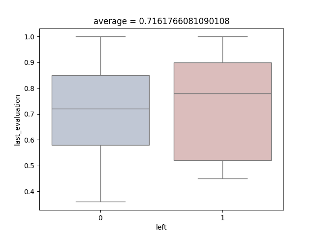
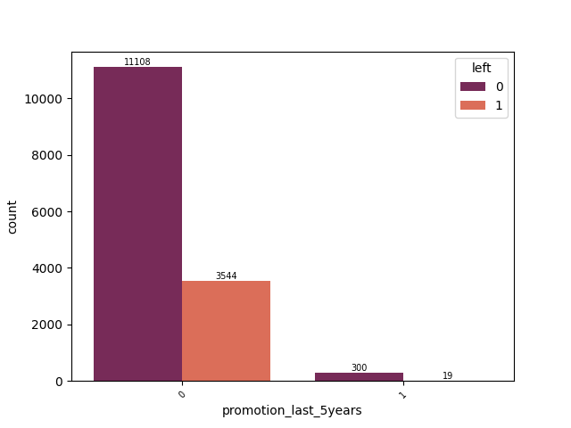

# FinalProject_3

# Human Resources Staff Sustainability Study:

In this study, the collection of the dataset is from the human resource department. It consists the data of
its staff members who has or hasn't left the company based on different conditions. The dataset contains their 
staff age, department, time at the company, satisfaction_level, working hours, work_evaluation, projects completed,
promotions and work_mishaps.

Based on these variables, we are to make a Machine Learning model that predicts weather a staff member leaves their 
job or not.

# Libraries used for this study

import os \
import pandas as pd \
import matplotlib.pyplot as plt\
import seaborn as sns\
from sklearn.model_selection import train_test_split\
from sklearn.liner_model import LogisticRegression
from sklearn.svm import SVC\
from sklearn.pipeline import Pipeline\
from sklearn.preprocessing import StandardScaler\
from sklearn.metrics import f1_score, accuracy_score, ConfusionMatrixDisplay

# Variables in the data

The datasets consist of one target(dependent) variable that is left.
The other independent variables(features) are:
* Satisfaction_level
* Last_evaluation
* Number_project
* Average_montly_hours
* Time_spend_company
* Work_accident
* Promotion_last_5years
* Department
* Salary
* Age             

# Data Inspection and Analysis

Steps to follow:

1. Indepth study of all the independent variables (feature)
2. Uni-variable study of dependent variable ('left') and figure out what type of variable it is.
3. Multi-variable study to find the relation between dependent (y) and independent (X) variable.
4. Cleaning the data if there is missing data (NaN), addressing outliers 
5. Selecting Independent and Dependent Variables
6. Splitting data into Training and testing sets
7. Algorithm Selection and Model Fitting
8. Check Accuracy of the model
9. Evaluate the results and Conclusion

# Step 1: Indepth study of all the independent variables (feature) and dependent variable (target)

# Independent Variables (X)

Satisfaction Level

It is a continuous quantitative data showing the satisfaction level of staff that ranges from 0.00 to 1.00, most satisfied being
1.00. We can see that staff who have above average satisfaction level are likely to stay put. We can also
see that 890 staff who has 0.0 satisfaction and 1384 staff with less than 0.5 satisfaction has left their jobs.
Therefore, we can say that satisfaction level does impact a staff choosing to stay or leave their work.

Last_evaluation

It is also a continuous quantitative data showing the work evaluation of the staff from 0.00 to 1.00. This data also shows that 
work evaluation is evenly distributed and likelihood of staying or leaving cannot be distinguished as average staff of staying and leaving 
is close to each other. This feature would have less impact on our Machine learning model.

Number_project

This data can be considered as a discrete quantitative data. It shows the number of projects each staff members have completed during their tenure at the company.
The lowest any staff has completed is 2 projects and the highest anyone has done is 7 projects.
It seems like staff who has completed 7 projects are bound to leave, the ones who have done 3-5 projects are likely to stay.
While, ones who are on their 2nd project tends to leave their job more often which makes me think that the 2nd project is a difficult one.
We can say that no.of project could be a good feature to predict ones job status.

Average monthly hours

This is a continuous quantitative data showing the average number of hours each staff members have worked in a month. The 
least hours clocked is 96 hours and the most clocked is 310 hours with an average hours worked is 200 hours in a month. 
The data of staff leaving is not evenly distributed as staff working under average hours is staying as well as leaving.
This feature is less likely to impact our ML model.

Time spent in the company

This is a discrete quantitative data showing the number of years spent working in the company. The data shows that the staff
has spent at least of 2 years and at most has worked for 10 years with most of the staff working there for the past 3.5 years.
Staff who are relatively in their 3rd, 4th and 5th years are likely to leave. But the ones who are on their 7 -10 years tends to stay assuming they are at higher job position.
Also, newer staffs are also likely to stay. Therefore, there is a distinction when staff may leave making this a good feature. 

Work Accident

This is a binary categorical data represented by 0 which means no work accident and 1 meaning the staff has encountered some kind of 
work accident. Generally, if there is an accident, we expect staff members to be on rest than to leave their job unless the accident is fatal.
In this context, the extremity of the accident cannot be weighed and staff who have had accident has stayed more than they left.
Also, the ones who hadn't had any work accidents also left. Therefore,this feature is not as reliable as it seems and may not work as a feature.

Promotions in the past 5 years

This is also a binary categorical data represented by 0 which means no promotion and 1 meaning, yes the staff has been promoted at least
once in the past 5 years. It shows that promotion is a rarity in this company and even if one staff isnt promoted, he/she hangs on.
only less than half of the staff who werent promoted has left their job. 
Furthermore, out of 319 ataff who got promoted, only 19 left their job for some reason.
Since, promotion is a rarity, this feature would not be as reliable.

Age

This is a continuous quantitative data giving the age of all the staff members. The youngest staff being 25 years old and
the oldest being 29 years old. This in average means the work force in the company is relatively young and not in line for
retirement anytime soon. However, the above figure shows that this data has more than 80% of its value missing. Therefore, there
is no point looking into this, and it will be dropped. 

The following commands are used to drop age column:

df.drop('age', axis = 1, inplace = True) \
print(df.head())  # to check that the age column is dropped 

Department

This is a categorical data and nominal in nature as department order is not essential. It consists of 10 departments
namely: 'IT' 'hr' 'support' 'product_mng' 'sales' 'technical' 'marketing' 'management' 'accounting' 'RandD'
Here, RandD represents a random department or can be considered a group with rest of the small departments. 
This feature is not useful as staff from any department can stay or leave their job. Hence, this feature will not be included.

Salary

In this dataset, salary is an ordinal categorical data as the salary ranges from low, medium and high. Its order is essential 
as higher salary staff tends to be more satisfied at work than a lower salary staff leading to more chance of staying at job. The above
figure shows that higher the salary, higher the chance they stay at their job.
Therefore, this feature will be included in our machine learning model.

# Dependent Variable (y)

Left

This is our target variable which is a binary categorical data of 0s and 1s. 0 representing that the staff hasn't left the job
and 1 representing that the staff has left the job due to certain factors.
This data shows that 3563 staff has left the job while 11408 is still at job.
With 29 rows removed due to NaN values in salary, the total comes up to 15000.
However, 4 are still missing from our actual total of 15004

print(df['left'].unique()) \
With this we found 3 unique values i.e. '0', '1' and '?'

# Cleaning the data if there is missing data (NaN)

The 'salary' data is missing some information. 

df.info() 
this showed us that out of 15004 rows salary has only 14975 rows i.e. data is missing in 29 rows.

print(df.loc[df.isna().any(axis = 1)])  
this lists outs the rows in which salary is missing.

* Visual representation of the 29 missing NaN in Salary

Code:

sns.scatterplot(y = df['salary'].isna(), x = df.index, marker = 'x', s = 100, hue = df['salary'].isna(),
                palette = 'mako', legend = False) \
plt.ylabel('0 = not NaN, 1 = NaN') \
plt.savefig(os.path.join(save_dir, 'NaN_salary_column.png'))
print(plt.show())

* Since only 29 rows out of 15004 rows are empty, we can drop NaN salary rows

df.dropna(subset = ['salary'], inplace = True) \
print(df.isna().sum())  # all 29 rows has been removed.

This data is categorical and needs to be converted into a quantitative data for our ML model to understand and give out accurate result.
we use the Label Encoding to do so.

from sklearn.preprocessing import LabelEncoder 

label_encoder = LabelEncoder() \
df['salary_encoded'] = label_encoder.fit_transform(df['salary']) \
custom_mapping = {'low': 0, 'medium': 1, 'high': 2} \
df['salary_encoded'] = df['salary'].map(custom_mapping)

print(df[['salary', 'salary_encoded']].head())  # comparing a newly created column with its origin

Figure: 'salary' is transformed into quantitative value, 'salary_encoded'

Similarly,

* '?' in 'left' column

print(df.loc[df['left'] == '?'].transpose())

'''there are 4 rows with '?' values in out target variable.
these are unknown cases in our target variable. it is sensible to consider this as a NaN value and
drop such rows'''

* dropping entire rows with target = ? as this is our dependent variable.

df.drop(df[df['left'] == '?'].index, inplace = True) \
print(f'Any = {df.loc[df['left'] == '?']}')  
empty DataFrame means no such datas with '?' anymore.

* now that we only have '0' and '1', they still are in string datat type.
In order for ML model to understand, we convert it into quantitative data by using Label Encoding

from sklearn.preprocessing import LabelEncoder 

label_encoder = LabelEncoder()

df['left_encoded'] = label_encoder.fit_transform(df['left'])\
custom_mapping2 = {'0': 0, '1': 1} \
df['left_encoded'] = df['left'].map(custom_mapping2)

print(df[['left', 'left_encoded']].head())  # comparing a newly created column with its origin

Now, the figure above in x-axis has integer values 0 and 1.

# Relation between dependent (y) and independent (X) variable.

As we observe the above heatmap, we see that none of the features have a strong positive
correlation with the target variable, 'left_encoded.'
Therefore, as we discussed while observing the features above, it seems sensible to have
satisfaction_level, number_project, time_spend_company and salary will be taken as primary features.
Although, last_evaluation, average_montly_hours, Work_accident and promotion_last_5years will have little to no impact on our result,
we will still consider adding them if it improved our result.
Finally, age and department will not be considered as features as age has more than 80% data missing
and department being a nominal categorical data has no impact on weather a staff stays or leaves.

# Selecting Independent and Dependent Variables

X = df[
    ['satisfaction_level', 'last_evaluation', 'number_project', 'average_montly_hours', 'time_spend_company',
     'Work_accident', 'promotion_last_5years', 'salary_encoded']]
y = df['left_encoded']

# Train Test Split

X_train, X_test, y_train, y_test = train_test_split(X, y, test_size = 0.2, random_state = 42)

#  Machine Learning Model
# using SVC

model = Pipeline([('scaler', StandardScaler()), ('svm', SVC(kernel = 'rbf', gamma = 'scale'))])
model.fit(X_train, y_train)

y_pred = model.predict(X_test)

#  Evaluation and Conclusion

# using f1 score to check accuracy and displaying Confusion matrix

print(f'f1_score = {f1_score(y_true = y_test, y_pred = y_pred)}')
print(f'accuracy_score = {accuracy_score(y_true = y_test, y_pred = y_pred)}')

# Evaluating using ConfusionMatrixDisplay

ConfusionMatrixDisplay.from_estimator(model, X_test, y_test, cmap = "Accent_r")
plt.title("kernel = rbf")
plt.savefig(os.path.join(save_dir, 'ConfusionMatrixDisplay_rbf.png'))
print(plt.show())

# Selecting features (X) and target (y)

X = df[
    ['satisfaction_level', 'last_evaluation', 'number_project', 'average_montly_hours', 'time_spend_company',
     'Work_accident', 'promotion_last_5years', 'salary_encoded']]
y = df['left_encoded']

# Splitting data into Training and testing sets

from sklearn.model_selection import train_test_split

X_train, X_test, y_train, y_test = train_test_split(X, y, test_size = 0.2, random_state = 42)

#  Algorithm Selection and Model Fitting

# using Logistic Regression

from sklearn.linear_model import LogisticRegression \
from sklearn.preprocessing import StandardScaler \
from sklearn.pipeline import Pipeline

model = Pipeline([('scaler', StandardScaler()), ('LogReg', LogisticRegression())]) \
model.fit(X_train, y_train)

y_pred = model.predict(X_test)

#  Evaluation and Conclusion

# using f1 score to check accuracy and displaying Confusion matrix (Logistic Regression)

from sklearn.metrics import f1_score, accuracy_score, ConfusionMatrixDisplay

print(f'f1_score = {f1_score(y_true = y_test, y_pred = y_pred)}') 

f1_score = 0.4624

print(f'accuracy_score = {accuracy_score(y_true = y_test, y_pred = y_pred)}')

accuracy_score = 0.7943

# Evaluating using ConfusionMatrixDisplay

ConfusionMatrixDisplay.from_estimator(model, X_test, y_test, cmap = "CMRmap")
plt.title("Logistic Regression") \
plt.savefig(os.path.join(save_dir,'ConfusionMatrixDisplay_LogReg.png')) \
print(plt.show())

Out of 20% test date, the model predicted: 

True Negative = 2114 \
True Positive = 265 \
False Negative = 451 \
False Positive = 165

# using Support Vector Classification (SVC)

from sklearn.svm import SVC
from sklearn.preprocessing import StandardScaler \
from sklearn.pipeline import Pipeline

model = Pipeline([('scaler', StandardScaler()), ('svm', SVC(kernel = 'rbf', gamma = 'scale'))]) \
model.fit(X_train, y_train)

y_pred = model.predict(X_test)

#  Evaluation and Conclusion

# using f1 score to check accuracy and displaying Confusion matrix

print(f'f1_score = {f1_score(y_true = y_test, y_pred = y_pred)}')

f1_score = 0.9272

print(f'accuracy_score = {accuracy_score(y_true = y_test, y_pred = y_pred)}')

accuracy_score = 0.9656

# Evaluating using ConfusionMatrixDisplay

ConfusionMatrixDisplay.from_estimator(model, X_test, y_test, cmap = "Accent_r") \
plt.title("kernel = rbf") \
plt.savefig(os.path.join(save_dir, 'ConfusionMatrixDisplay_rbf.png')) \
print(plt.show())

The above confusion matrix shows that there is relatively less Type 1 and Type 2 error
suggesting that this ML model is very accurate. 

Out of 20% test date, the model predicted: 

True Negative = 2236 \
True Positive = 656 \
False Negative = 60 \
False Positive = 43 

