# FinalProject_4

# Human Resources Staff Sustainability Study:

In this study, we will be looking into safe drinking-water which is essential to health, a basic human right and a
component of effective
policy for health protection. "Health is wealth" is a slogan that everyone has heard of and quality drinking water is
one of the main
factors that affects the health of a person. It is also clear as water that prevention is better than cure. Similarly,
it is sensible to
invest in checking the quality of drinking water than to spend on curing diseases caused by unsafe drinking water.

This project is to tackle this situation by creating a Machine Learning model based on the data that produces the
potability
of water. We will consider the variables associated with potability to determine which quality of water seems to be safe
to drink.

# Libraries used for this study

import os \
import pandas as pd \
import matplotlib.pyplot as plt\
import seaborn as sns\
from sklearn.model_selection import train_test_split\
from sklearn.liner_model import LogisticRegression
from sklearn.svm import SVC\
from sklearn.pipeline import Pipeline\
from sklearn.preprocessing import StandardScaler\
from sklearn.metrics import f1_score, accuracy_score, ConfusionMatrixDisplay

# Variables in the data

The datasets consist of one target(dependent) variable that is Potability.
The other independent variables(features) are:

* ph
* Hardness
* Solids
* Chloramines
* Sulfate
* Conductivity
* Organic_carbon
* Trihalomethanes
* Turbidity

# Data Inspection and Analysis

Steps to follow:

1. Indepth study of all the independent variables (feature)
2. Uni-variable study of dependent variable ('left') and figure out what type of variable it is.
3. Multi-variable study to find the relation between dependent (y) and independent (X) variable.
4. Cleaning the data if there is missing data (NaN), addressing outliers
5. Selecting Independent and Dependent Variables
6. Splitting data into Training and testing sets
7. Algorithm Selection and Model Fitting
8. Check Accuracy of the model
9. Evaluate the results and Conclusion

# Step 1: Indepth study of all the independent variables (feature)

* ph Value

PH is an important parameter in evaluating the acid–base balance of water. It is also the indicator of acidic or
alkaline condition of water status. WHO has recommended maximum permissible limit of pH from 6.5 to 8.5. The current
investigation ranges were 6.52–6.83 which are in the range of WHO standards.

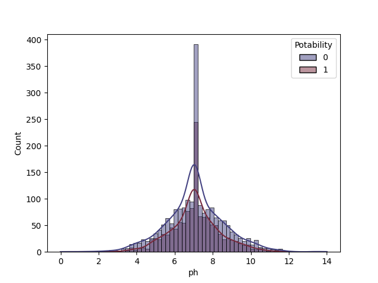
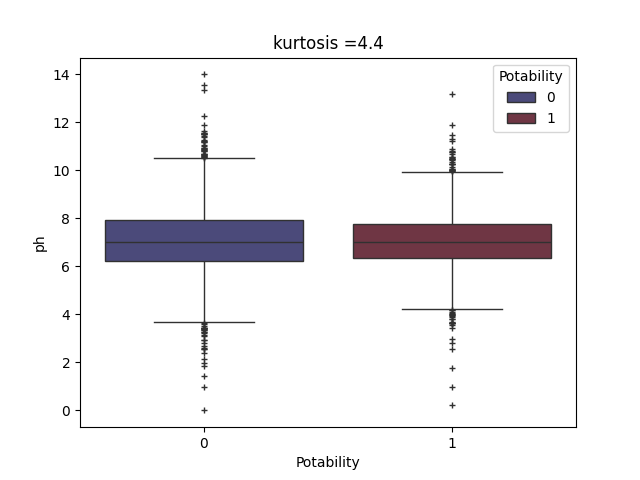

* Hardness

Hardness is mainly caused by calcium and magnesium salts. These salts are dissolved from geologic deposits through which
water travels. The length of time water is in contact with hardness producing material helps determine how much hardness
there is in raw water. Hardness was originally defined as the capacity of water to precipitate soap caused by Calcium
and Magnesium.

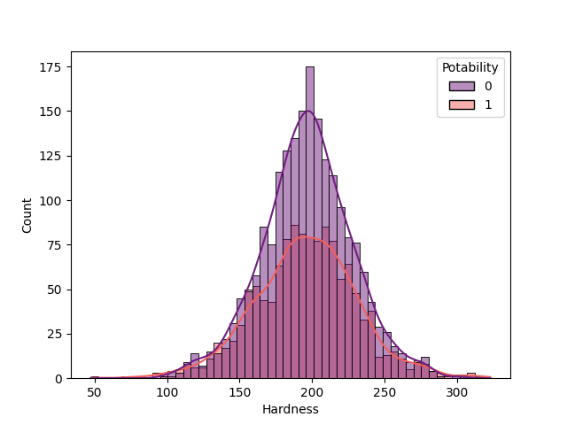
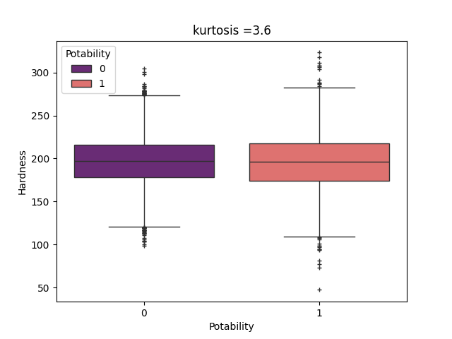

* Solids

Water has the ability to dissolve a wide range of inorganic and some organic minerals or salts such as potassium,
calcium, sodium, bicarbonates, chlorides, magnesium, sulfates etc. These minerals produced un-wanted taste and diluted
color in appearance of water. This is the important parameter for the use of water. The water with high TDS value
indicates that water is highly mineralized. Desirable limit for TDS is 500 mg/l and maximum limit is 1000 mg/l which
prescribed for drinking purpose.

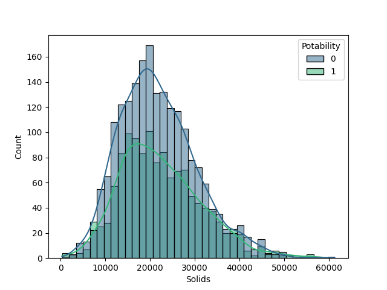
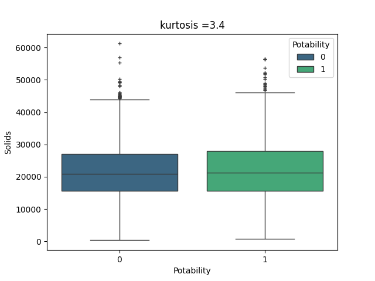

* Chloramines

Chlorine and chloramine are the major disinfectants used in public water systems. Chloramines are most commonly formed
when ammonia is added to chlorine to treat drinking water. Chlorine levels up to 4 milligrams per liter (mg/L or 4 parts
per million (ppm)) are considered safe in drinking water.

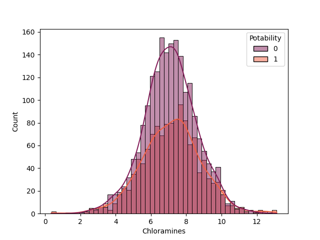
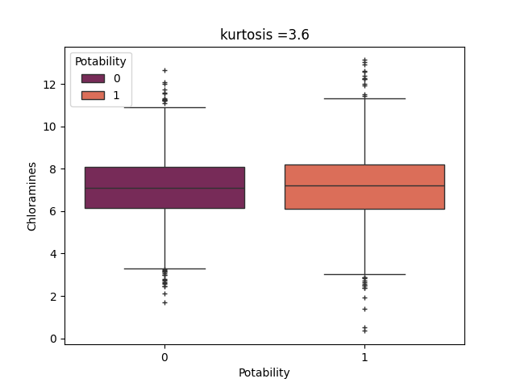

* Sulfate

Sulfates are naturally occurring substances that are found in minerals, soil, and rocks. They are present in ambient
air, groundwater, plants, and food. The principal commercial use of sulfate is in the chemical industry. Sulfate
concentration in seawater is about 2,700 milligrams per liter (mg/L). It ranges from 3 to 30 mg/L in most freshwater
supplies, although much higher concentrations (1000 mg/L) are found in some geographic locations.

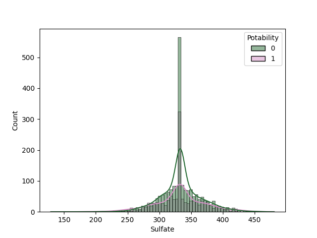
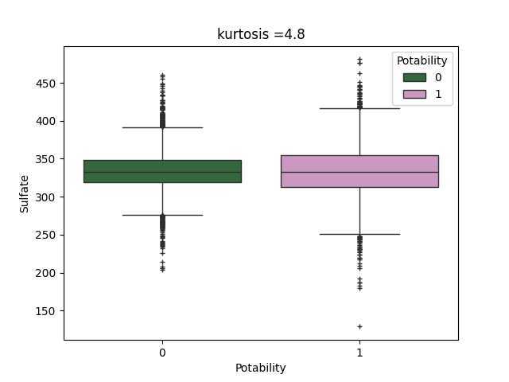

* Conductivity

Pure water is not a good conductor of electric current rather’s a good insulator. Increase in ions concentration
enhances the electrical conductivity of water. Generally, the amount of dissolved solids in water determines the
electrical conductivity. Electrical conductivity (EC) actually measures the ionic process of a solution that enables it
to transmit current. According to WHO standards, EC value should not exceed 400 μS/cm.

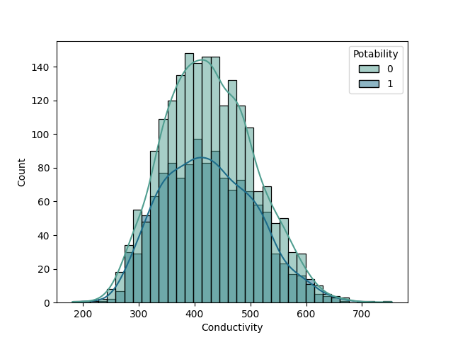
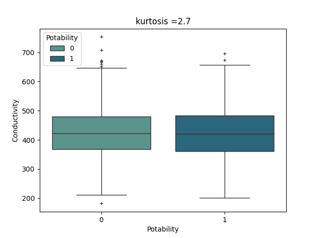

* Organic_carbon

Total Organic Carbon (TOC) in source waters comes from decaying natural organic matter (NOM) as well as synthetic
sources. TOC is a measure of the total amount of carbon in organic compounds in pure water. According to US EPA < 2 mg/L
as TOC in treated / drinking water, and < 4 mg/Lit in source water which is use for treatment.

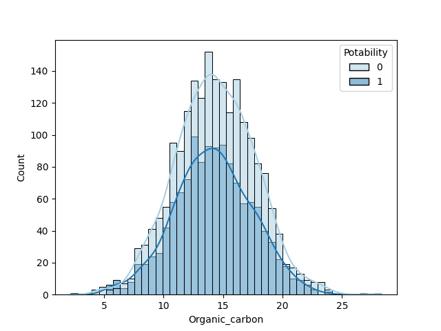
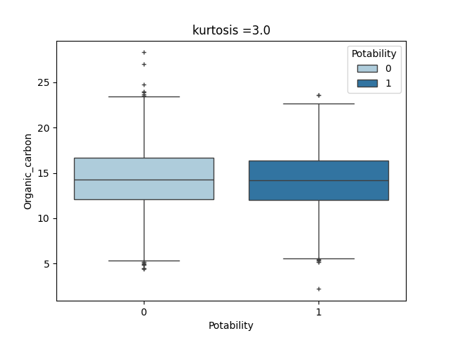

* Trihalomethanes

THMs are chemicals which may be found in water treated with chlorine. The concentration of THMs in drinking water varies
according to the level of organic material in the water, the amount of chlorine required to treat the water, and the
temperature of the water that is being treated. THM levels up to 80 ppm is considered safe in drinking water.

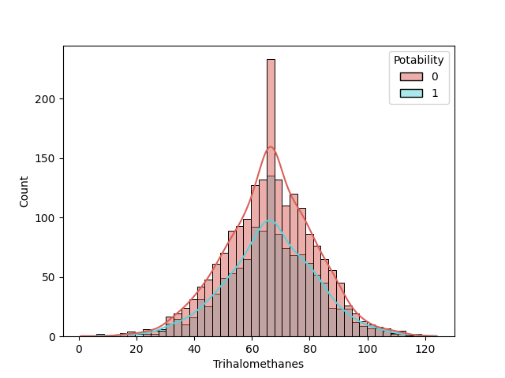
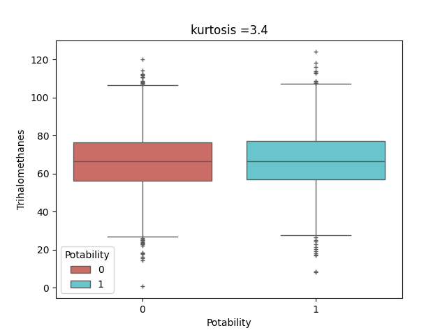

* Turbidity

The turbidity of water depends on the quantity of solid matter present in the suspended state. It is a measure of light
emitting properties of water and the test is used to indicate the quality of waste discharge with respect to colloidal
matter. The mean turbidity value obtained for Wondo Genet Campus (0.98 NTU) is lower than the WHO recommended value of
5.00 NTU.

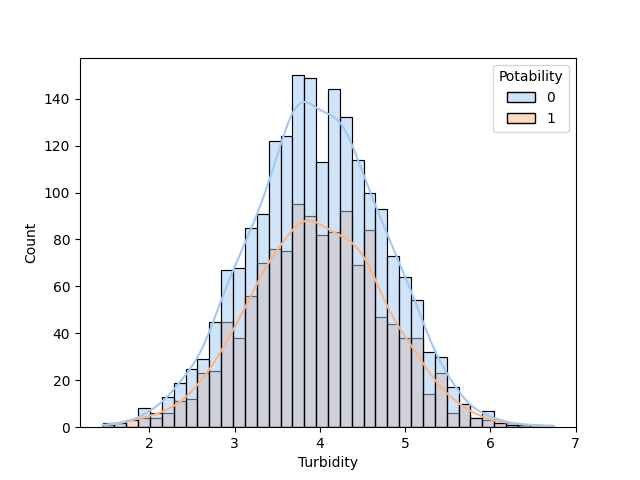
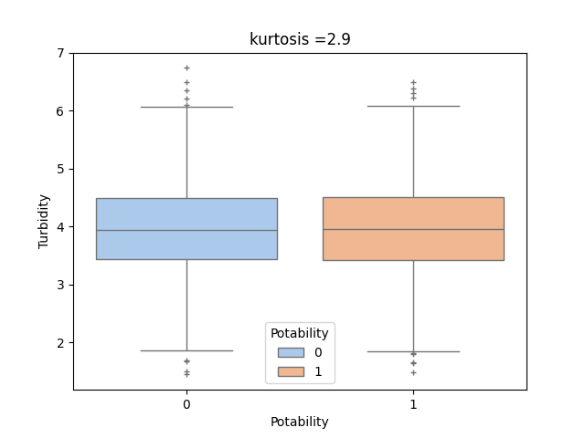

# Step2: Uni-variable study of dependent variable ('Potability') and figure out what type of variable it is.

* Potability
Indicates if water is safe for human consumption where 1 means Potable and 0 means Not potable.

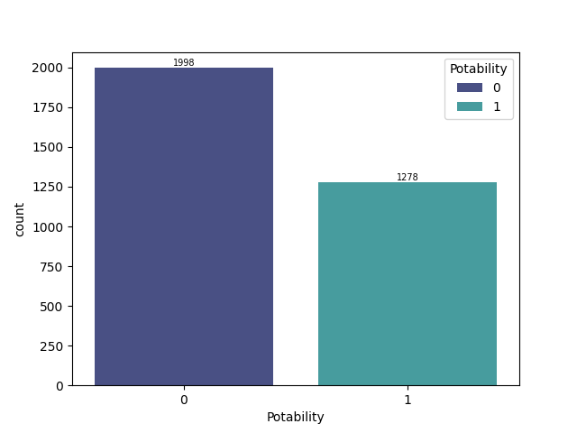

# Step 3: Multi-variable study to find the relation between dependent (y) and independent (X) variable.

* pairplot
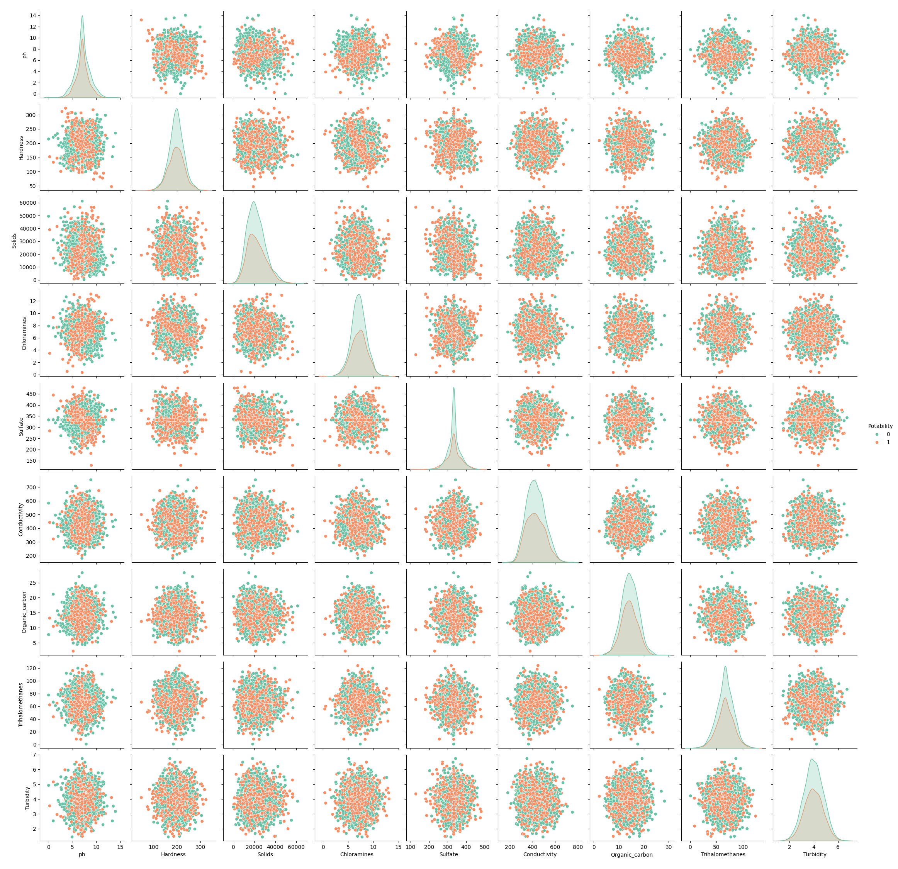

* correlation
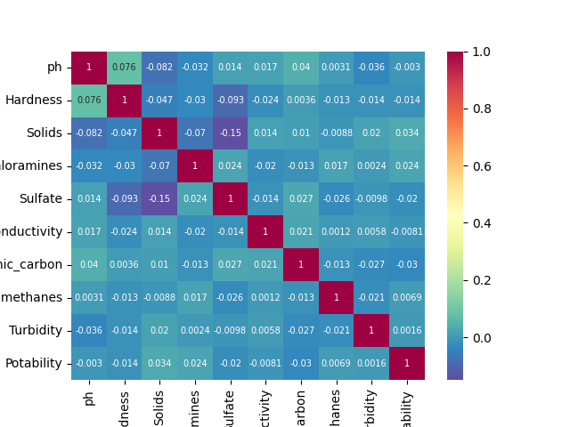

# Step 4: Cleaning the data if there is missing data (NaN), addressing outliers

* Handling Missing datas using median

* ph missing data

'contains outliers so using median to fill data' \
df['ph'] = df['ph'].fillna(df['ph'].median())

* sulfate missing data

'contains outliers so using median to fill data' \
df['Sulfate'] = df['Sulfate'].fillna(df['Sulfate'].median())

* Trihalomethanes missing data

'contains outliers so using median to fill data' \
df['Trihalomethanes'] = df['Trihalomethanes'].fillna(df['Trihalomethanes'].median())

* confirming no NaN remains

print(df.isna().sum())

# Handling outliers 
# using z-score to remove outliers less tha z-score 3
z_scores = np.abs(stats.zscore(df))
df = df[(z_scores < 3).all(axis = 1)]

print(df.info())

# Step 5: Selecting Independent and Dependent Variables

X = df[['ph', 'Hardness', 'Solids', 'Chloramines', 'Sulfate', 'Conductivity', 'Organic_carbon',
        'Trihalomethanes', 'Turbidity']] \
y = df['Potability']

# Step 6: Splitting data into Training and testing sets

from sklearn.model_selection import train_test_split

X_train, X_test, y_train, y_test = train_test_split(X, y, test_size = 0.2, random_state = 42)

# Step 7: Algorithm Selection and Model Fitting

from sklearn.pipeline import Pipeline \
from sklearn.preprocessing import StandardScaler, RobustScaler \
from sklearn.svm import SVC \

model = Pipeline([('scaler', StandardScaler()), ('svc', SVC(kernel = 'rbf', gamma = 'scale', C = 1.0))]) \
model.fit(X_train, y_train)

# Step 8: Check Accuracy of the model

from sklearn.metrics import f1_score, accuracy_score, ConfusionMatrixDisplay

print(f'f1_score = {f1_score(y_true = y_test, y_pred = y_pred)}') \
print(f'Accuracy = {accuracy_score(y_true = y_test, y_pred = y_pred)}') \

*Confusion Matrix Display

ConfusionMatrixDisplay.from_estimator(model, X_test, y_test, cmap = "Spectral") \
plt.title("kernel = rbf") \
plt.savefig(os.path.join(save_dir, 'ConfusionMatrixDisplay_rbf.png')) \
print(plt.show())

# for SVC

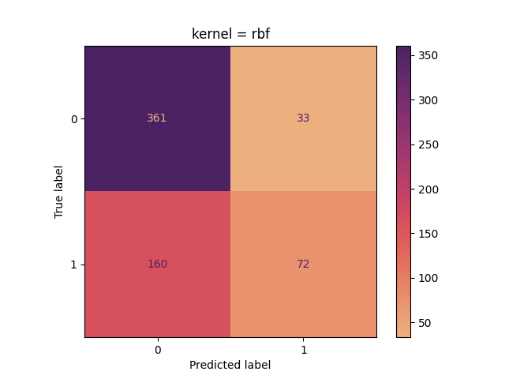

f1_score = 0.4272
accuracy = 0.6916

True Negative = 361
False Negative = 160
True Positive = 72
False positive = 

# for logistic regression

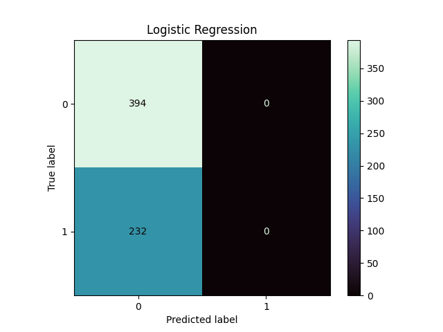

f1_score = 0.0
accuracy = 0.6293

True Negative = 394
False Negative =232
True Positive = 0
False positive = 0

# step 9: Evaluate the results and Conclusion

We identified missing values and replaced it with median as there were many outliers as mean is sensitive
to outliers unlike median which is robust to outliers.

We also minimized outliers using zscore and removed outliers greater than 3.

Although, the result is not optimal, Support Vector Classifier gave us the better result compared to Logistic
Regression. This maybe because the data provided is in small scale greater accuracy cannot be achieved.