# FinalProject_1

# Diabetes Prediction Study:

In this study, the objective of the dataset is to diagnostically predict whether a patient has diabetes or not. Several constraints were placed on the selection of these instances from a larger database. In particular, all patients here are females at least 21 years old of Pima Indian heritage.

# Libraries used for this study

import os \
import pandas as pd \
import matplotlib.pyplot as plt\
import seaborn as sns\
from scipy.stats import kurtosis\
from sklearn.model_selection import train_test_split\
from sklearn.svm import SVC\
from sklearn.pipeline import Pipeline\
from sklearn.preprocessing import StandardScaler\
from sklearn.metrics import f1_score, accuracy_score, ConfusionMatrixDisplay

# Variables in the data

The datasets consist of one target(dependent) variable that is Outcome.
The other several medical predictor variables(features) are:
* Pregnancies
* Glucose 
* BloodPressure 
* SkinThickness    
* Insulin        
* BMI  
* DiabetesPedigreeFunction 
* Age 
* Outcome

# Data Inspection and Analysis

Steps to follow:

1. Indepth study of all the independent variables (feature)
2. Uni-variable study of dependent variable ('Outcome') and figure out what type of variable it is.
3. Multi-variable study to find the relation between dependent (y) and independent (X) variable.
4. Cleaning the data if there is missing data (NaN), outliers 
5. Selecting Independent and Dependent Variables
6. Splitting data into Training and testing sets
7. Algorithm Selection and Model Fitting
8. Check Accuracy of the model
9. Evaluate the results and Conclusion

# Step 1: Studying Independent Variables (X)

* Pregnancies:

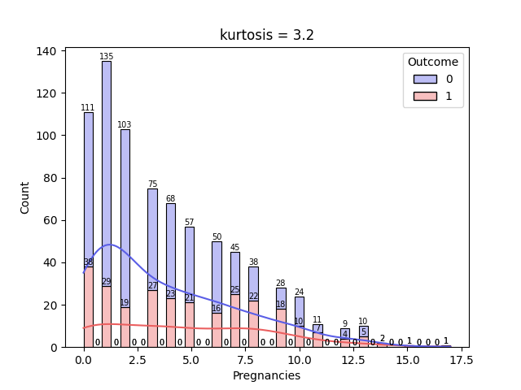

Continuous data, seems like right skewness as there are many 0 pregnancies. My initial assumption is that it may have weak correlation with diabetes.

* Glucose:

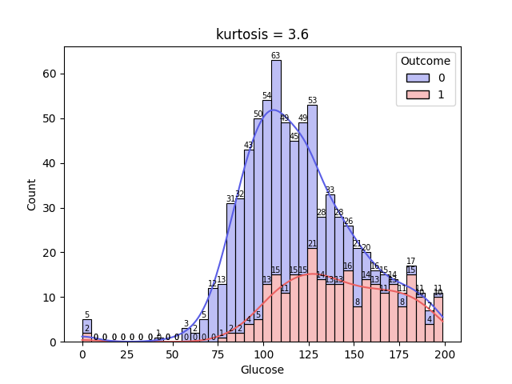

It consists the report of 2 hours oral glucose tolerance test. Continuous data and is normally distributed. It may have a strong relation with diabetes.

* BloodPressure:

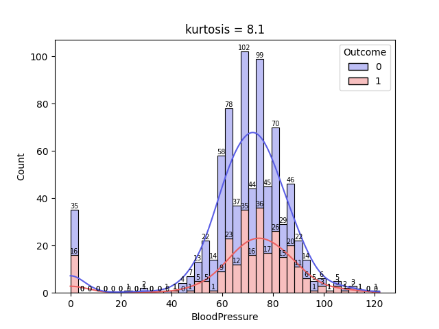

Diastolic blood pressure report. Continuous data and seems like it is normally distributed. However, it has subgroups suggesting multi-modality. I am assuming blood pressure could have positive correlation with diabetes.

* Skin Thickness: 

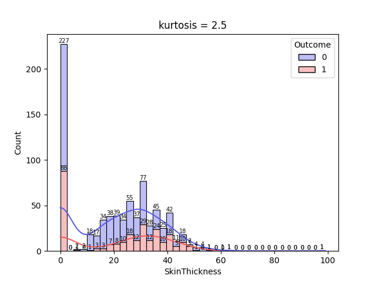

Triceps skin fold thickness in (mm). Continuous data, uniform distributed and has lots of 0s. However, it has subgroups suggesting multi-modality. May have low relation with diabetes.

* Insulin:

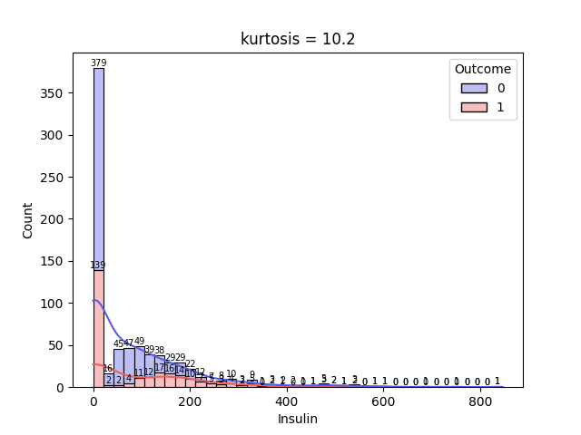

Continuous data, right skewness and has lots of 0s. Many outliers. Assuming weak correlation with diabetes.

* BMI: 

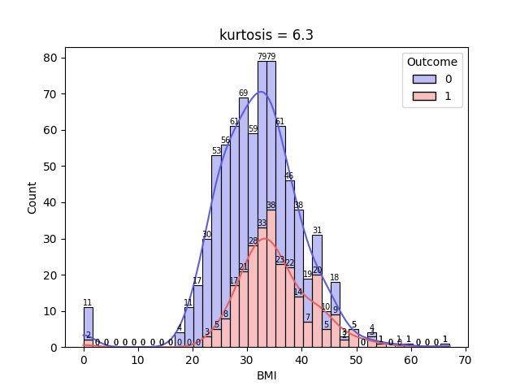

Continuous data with normal distribution.Few datas in 0s suggesting multi-modality. May have positive correlation with outcome.

* DiabetesPedigreeFunction: 

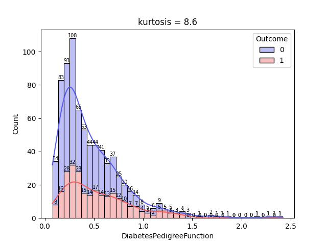

Continuous data, right skewness. Many outliers but May have weak correlation with outcome.

* Age:

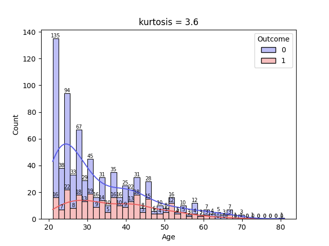

Continuous data, not normally distributed as lots of female are 21 years old. Assuming age may have positive correlation with outcome.

# Step 2: Studying Dependent Variable(y)

Outcome

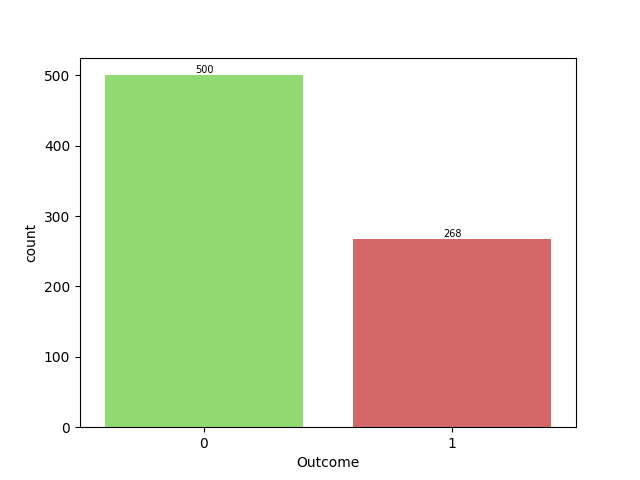

It is a binary data type of categorical data. 0s indicating that the patient is not diabetic and 1s representing that the patient is diabetic.
The above figure shows that 500 people do not have diabetes and 268 have diabetes.

Since, outcome is a categorical data, we will be carrying out binary classification.
Some of the algorithms we can use here are:
* Logistic Regression
* Support Vector Machine (SVM) (best)
* Random Forests
* Decision Trees

# Step 3: Finding relation between the feature(X) and target(y) variable.

Based on observation, I can see that we should be avoiding abnormally distributed data as it isn't reliable. There are lots of diabetic who are not pregnant, no insulin consumption or lacks skin thickness.
Also, Age is abnormally distributed as there are lots of 21 years old. Diabetic Pedigree will be studied.
Finally, BMI, blood-pressure and Glucose level seems like normally distributed and may be more reliable than others.
# Pairplot
sns.pairplot(df, hue = 'Outcome', height = 1.5, aspect = 1)
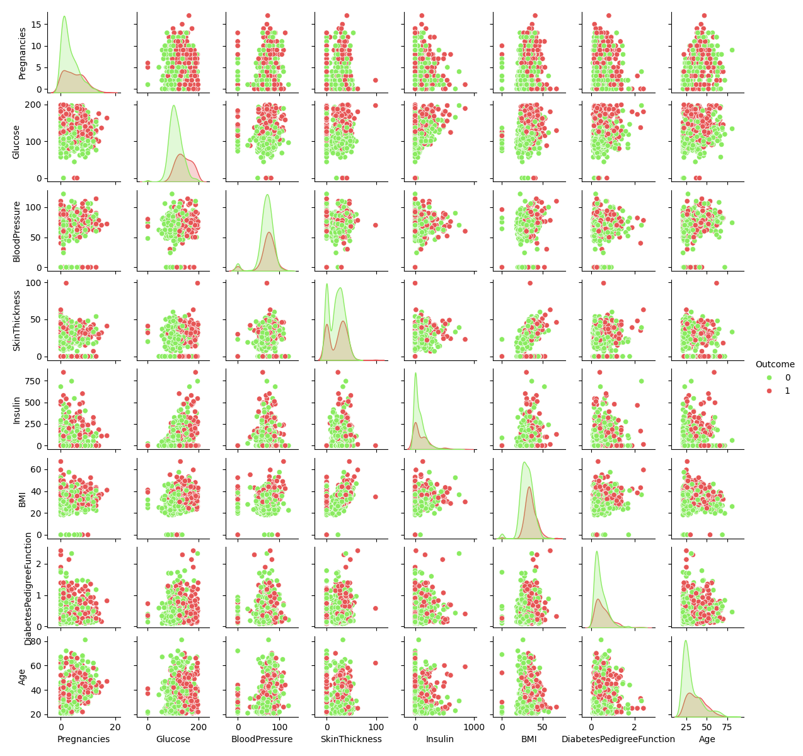

Upon observing the pair-plot, I was unable to distinguish any sorts of precise correlation between the variables. However, I can confirm that there are many outliers in some variables.
Also, there is right sided skewness in Pregnancies, Insulin, Diabetes Pedigree Function and Age.
Furthermore, there is multi-modality in Skin Thickness and Blood Pressure have two peaks each.
We will be looking in each individual features to find outliers below. 
# Heatmap
sns.heatmap(df.corr(numeric_only = True),
       'shrink': 0.8})
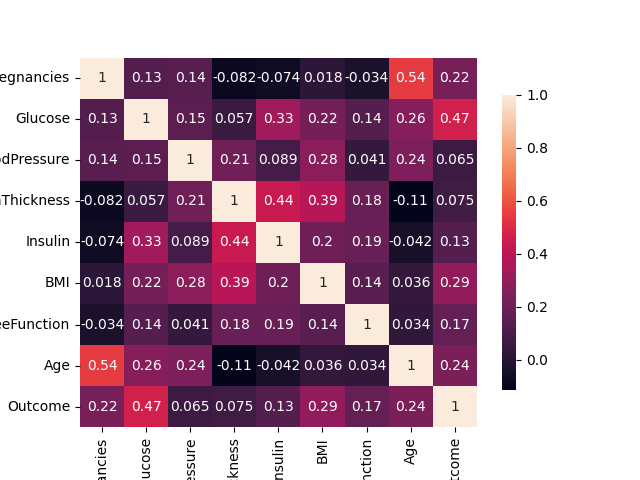

The above figure shows that the highest correlation "Outcome" has is 0.47 corr. coefficient with Glucose (marked as red).
Other close ones are BMI, Age and Pregnancies with corr. coefficient 0.29, .0.24 and 0.22 respectively. 
However, all of them are close to 0 having moderately weak collinearity.

Furthermore, independent variables such as Pregnancies and Age are correlated with corr. coefficient of 0.54. This is a problem of multi-collinearity.
In such a case, we have to drop one column.
We should drop Pregnancies column as its coefficient with outcome is less than Age and also because it is not appropriate to ask women how many times one has been pregnant.
Its crazy how people are pregnant 17 times.

Therefore, Glucose, BMI and Age are considered as appropriate independent variables for Diabetes prediction.

# Boxplot for detecting outliers

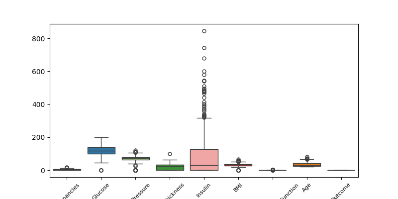

The figure shows that there is significant outliers in 'Insulin'
Considering Glucose, BMI and Age, outliers are present in them as well but not as significant as one in Insulin.
Therefore, we should consider selecting Machine Learning algorithm that is robust to outliers.

# Step 4: Data cleanup
print(df.info()) \
Out of 768 entries 768 are not null.

print(df.isna().sum())
* Pregnancies                 0
* Glucose                     0
* BloodPressure               0
* SkinThickness               0
* Insulin                     0
* BMI                         0
* DiabetesPedigreeFunction    0
* Age                         0
* Outcome                     0

Hence, we conclude that there is no missing data. No further action needed.

# Step 5: Selecting Independent(X) and Dependent(y) Variables

We know that independent variable aka feature should be a DataFrame aka 2 Dimensional.
Whereas, dependent variable aka target should be s Series aka 1 dimensional.
BEWARE OF THE USE OF SQUARE BRACKETS [[]].

For our model testing, we have decided on taking Glucose, BMI and Age as features (X)
As for our target (y), we know that it is Outcome. 

X = df.loc[:, ["Glucose", "BMI", "Age"]]  # DataFrame 2-Dimension \
y = df['Outcome']  # Series 1-Dimension

# Step 6: Train Test Split
from sklearn.model_selection import train_test_split 

X_train, X_test, y_train, y_test = train_test_split(X, y, test_size = 0.2, random_state = 40)

Here, we divide our data using test_size 0.2, meaning 80% of the data is used for training the model and 20% is used to test the model.
random_state is set to 40 to set uniform result throughout.

# Step 7: Machine Learning Model

As our target variable is a binary classification, it is appropriate that we use Support Vector Machine(SVM) 
Using SVM for the following reasons:
Clear Separation: SVM can find the optimal hyperplane that separates diabetic or non-diabetic with maximum margin.
High-Dimensional Data: The feature space might include thousands of words (features). Although, we dont have any.
Non-linear Relationships: The relationship between features and the target is complex in our case. So, SVM can use the kernel trick to transform the data and find a suitable separating hyperplane.
Overfitting Control: By adjusting the regularization parameter, SVM can be fine-tuned to avoid overfitting to the training data.

from sklearn.svm import SVC \
from sklearn.pipeline import Pipeline \
from sklearn.preprocessing import StandardScaler 

model = Pipeline([('scaler', StandardScaler()), ('svm', SVC(kernel = 'linear', gamma = 'scale'))])
model.fit(X_train, y_train)
y_pred = model.predict(X_test)

In the above code, I am scaling the independent data using Standard Scaler because the range of Glucose is from 0 to 199. Whereas, Age ranges from 21 to 81 and BMI ranges from 0 to 67.1.
Pipeline is used here to chain preprocessing step and model fitting step.
Once, this is done, I used .fit() function to fit X_train and y_train that we separated in the previous step.
After this, I created a target prediction variable using .predict() function to input X_test in the SVM model.

Kernel tricks is one such advantage of using SVC. By default, 'rbf' is set as kernel.
Some of the kernel tricks are:

Linear Kernel('linear'): Used for linearly separable data.
Polynomial Kernel('poly'): Suitable for non-linear data.
Radial Basis Function Kernel ('rbf'): Popular for non-linear data, measures the distance between data points in an exponential manner.
Sigmoid Kernel('sigmoid'): Used as a proxy for neural networks.

Even though our data is complex while observing, 'rbf' is suggested in this case. 
However, using Liner Kernel produced better f1_score and accuracy score.

# Step 8:Using f1 score and accuracy_score to check accuracy and displaying Confusion matrix

print(f'f1_score = {f1_score(y_true = y_test, y_pred = y_pred)}')\
print(f'accuracy_score = {accuracy_score(y_true = y_test, y_pred = y_pred)}')

While using 'rbf' kernel:
f1_score = 0.62
accuracy = 0.7532

While using 'linear' kernel:
f1_score = 0.6734
accuracy = 0.7922

# Step 9: Evaluating the result

from sklearn.metrics import f1_score, accuracy_score, ConfusionMatrixDisplay

ConfusionMatrixDisplay.from_estimator(model, X_test, y_test, cmap = "Accent_r")
plt.savefig(os.path.join(save_dir, 'ConfusionMatrixDisplay.png'))
print(plt.show())

Result:
While using 'rbf' kernel:

While using 'linear' kernel:

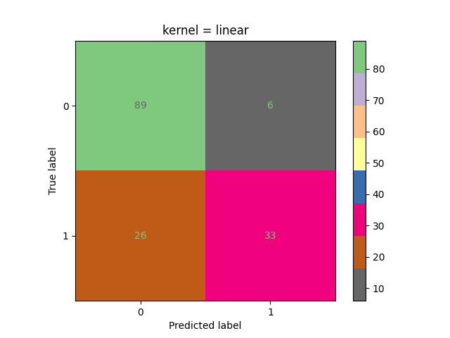

Lets talk about while using Linear Kernel:

The confusion matrix shows that the model predicted:
True Negative 89 times
True Positive 33 times
False Negative 26 times
False Positive 6 times

Since False Positive(Type 1 Error) is low, precision of this model is high.
False Negative(Type 2 Error) is relatively low. However, we can still minimize this.

